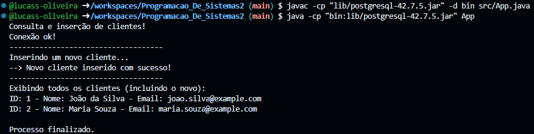

# Projeto Java - Conexão com Supabase

Este projeto conecta-se ao banco de dados PostgreSQL hospedado no **Supabase**, realiza uma consulta na tabela `clientes` e exibe os dados no console.

## Tecnologias Utilizadas

- **Java** 
- **PostgreSQL JDBC Driver**
- **Supabase**

## Como Rodar o Código

### 1. **Pré-requisitos**

- **Java**: Verifique com `java -version`.

### 2. **Baixar o Driver JDBC**

1. Baixe o driver JDBC do PostgreSQL [aqui](https://repo1.maven.org/maven2/org/postgresql/postgresql/42.7.5/postgresql-42.7.5.jar).
2. Coloque o arquivo JAR na pasta `lib` do seu projeto.

### 3. **Configuração**

1. Altere as credenciais no código `App.java`:
   - **URL de conexão**: `jdbc:postgresql://aws-1-sa-east-1.pooler.supabase.com:6543/postgres`
   - **Usuário**: `postgres.wdkkakpbcxfzqhjalxse`
   - **Senha**: `nX1D07utAev1mVx3`

2. Compile e execute:
   - **Compilar**: `javac -cp ".;lib/postgresql-42.7.5.jar" App.java`
   - **Executar**: `java -cp ".;lib/postgresql-42.7.5.jar" App`

## Como Funciona

1. **Conexão**: O código usa **JDBC** para conectar ao banco de dados.
2. **Consulta**: Executa a consulta `SELECT * FROM clientes` e imprime os dados no console.
3. **Fechamento**: Após a consulta, a conexão é fechada.

## Justificativa

- **JDBC** é o método padrão para conectar Java a bancos PostgreSQL.

